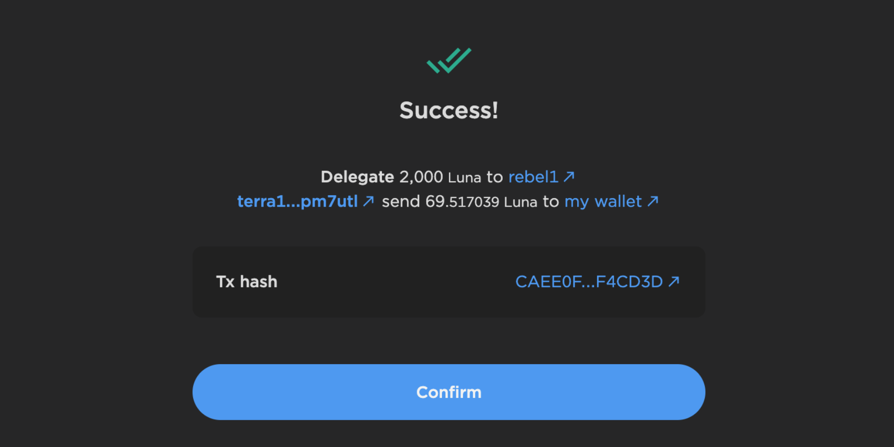

# Emergency Management and Recovery of Luna Classic



This repository contains the upgrade instructions for Columbus-5, Terra's official mainnet. 

**[Columbus-5](https://github.com/terra-rebels/classic-core) is the latest version of v0.5.21**.

## Terra Rebels community

For information about the v0.5.21 release, developers are active and can be found here:

- [Discord](https://discord.gg/RCm7PuT9wF)

Details on the code changes, implementation, and test results can be found here:

- [White Paper](https://arxiv.org/pdf/2207.01700.pdf)

## The Community Blockchain 

We have no affiliation with Terraform Labs (TFL) nor work under any central organization or established entity at this time. We, the community, are filling the developer void impartially and in accordance with community proposals that pass the voting process. 

Upon completion of v21, the installation of the software would be to simply,

```
git clone https://github.com/terra-rebels/classic-core.git
```

navigate to the classic-core directory 

```
cd classic-core
```
Get the Version 21 branch
```
git checkout v0.5.21
```
build/install the new version of terrad
```
make install

```
Run terrad
```
terrad start
```

## Disclaimer From Terra Rebels

*We are adopting a legacy code base that was not developed by us, nor are being given guidance by the creators. We ask that those who have the knowledge or resources contact us to help rebuild the Terra Classic ecosystem.*

## Existing Disclaimer From Terraform Labs

The foundational software for the Columbus mainnet, Terra Core, is *highly* experimental software. In these early days, we can expect to have issues, updates, and bugs. The existing tools require advanced technical skills and involve risks which are outside of the control of Terraform Labs or its developers. Any use of this open source Apache 2.0 licensed software is done at your _own risk and on a “AS IS” basis, without warranties or conditions of any kind_. **Please exercise extreme caution!**

